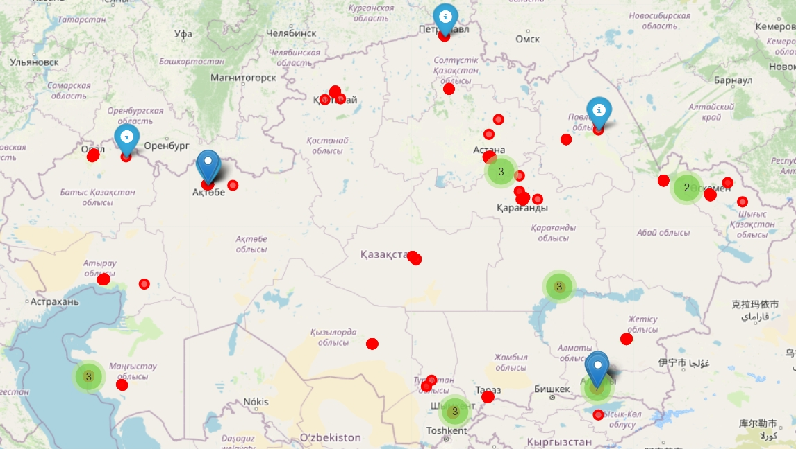

# 🗺️ Interactive Map of Kazakhstan  

An interactive web map built with **Leaflet.js**, showcasing key regions of **Kazakhstan** with clickable markers and popups. This project highlights how data visualization and mapping can make geographic information accessible and engaging.  

## 🚀 Features  
- 🗺️ **Interactive Map Interface** – zoom, pan, and explore Kazakhstan  
- 📍 **Custom Markers** – major cities and regions with clickable popups  
- 🎨 **Clean UI** – simple, responsive design optimized for browsers  
- ⚡ **Lightweight** – built with plain HTML, CSS, and JavaScript for fast loading  

## 🛠️ Tech Stack  
- **Frontend:** HTML, CSS, JavaScript  
- **Mapping Library:** [Leaflet.js](https://leafletjs.com/)  
- **Hosting:** GitHub Pages  

## 📷 Screenshot  

